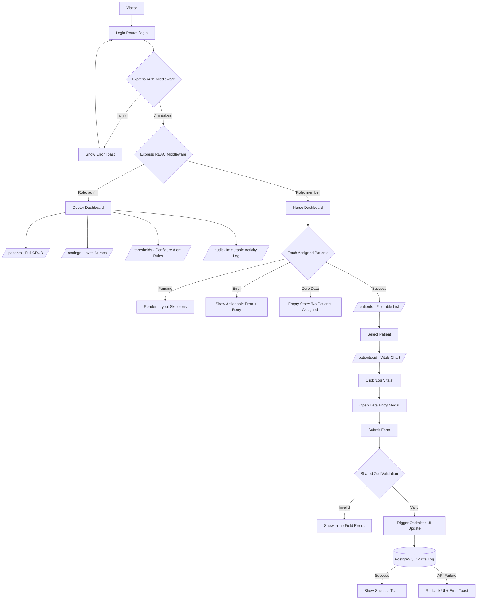

## 1. Architecture & Application Flow

## 2. Explicit Assumptions

-  Tech Stack: React (Frontend), Node.js/Express (Backend API), PostgreSQL (Database), Prisma(ORM) and strict TypeScript across the entire monorepo/codebase.

-  Authentication: Session-based or JWT authentication using httponly cookies. Roles (admin, member , viewer )are enforced server-side via Express middleware.

-  Data Volume: A patient will generate hundreds of vital logs over a stay. We will use cursor-based pagination for fetching historical logs to maintain performance.

-  Timezones: All timestamps ( recordedAt , createdAt ) are stored in UTC in the database and localized on the client side using the browser's timezone.

## 3. User Stories

-  As a Clinic Admin (Doctor), I want to create and manage patient profiles so that I can assign them to nursing staff.

-  As a Clinic Admin (Doctor), I want to configure specific minimum and maximum threshold rules for vitals (e.g., HR > 120) per patient, so that the system knows when to trigger an alert.

-  As a Nurse, I want to view a list of my assigned patients, sorted by active alerts, so I know who needs immediate attention.

-  As a Nurse, I want to log new vitals for a patient through a fast, keyboard-navigable form so I can return to patient care quickly.

-  As a Nurse, I want to see a historical chart of a patient's vitals so I can track trends over their stay.

-  As a Nurse, I want to acknowledge an active alert so the system logs that a clinician has reviewed the critical reading.

## 4. Acceptance Criteria

-  UI/UX: Every asynchronous action (fetching patients, submitting vitals) must explicitly handle loading (skeletons), empty , error (with actionable retry), and success states.

-  Validation: Both the React frontend forms and the Express API endpoints must validate payloads using the exact same Zod schema.

-  Optimistic UI: Submitting a vitals log must instantly update the local React state. If the Express API returns an error, the UI must roll back the optimistic update and display an error toast.

-  RBAC Enforcement: An API request to /api/thresholds by a user with the member (Nurse) role must return a 403 Forbidden error.

-  Accessibility: The vitals entry modal must be fully operable via keyboard (Tab to navigate, Enter to submit, Esc to close) and trap focus while open.

## 5. Data Shapes (Database Schema & Types)

## User

-  id : UUID (Primary Key)

- email : String (Unique)

-  passwordHash : String

-  role : Enum ( ADMIN , NURSE , PATIENT )

-  name : String

-  createdAt / updatedAt : DateTime

## Patient

-  id : UUID (Primary Key)

-  firstName : String

-  lastName : String

-  dateofBirth : DateTime

-  status : Enum ( ADMITTED , DISCHARGED )

-  createdAt / updatedAt : DateTime

## vitallog

-  id : UUID (Primary Key)

-  patientId: UUID (Foreign Key -> Patient)

-  nurseld : UUID (Foreign Key -> User)

-  heartrate : Int (Nullable)

-  sistolicBp: Int (Nullable)

-  diastolicBp : Int (Nullable)

- temperature : Float (Nullable)

- recordedAt : DateTime (Defaults to now, but can be manually backdated if entered late)

## AlertThreshold

- id : UUID (Primary Key)

- patientId : UUID (Foreign Key -> Patient)

- metricType : Enum ( HEART_RATE , BLOOD_PRESSURE , TEMPERATURE )

- minvalue : Float (Nullable)

- maxvalue : Float (Nullable)

## Alert

-  id : UUID (Primary Key)

-  patientId : UUID (Foreign Key -> Patient)

- vitallLogId : UUID (Foreign Key -> VitalLog)

-  status : Enum ( ACTIVE , ACKNOWLEDGED )

- acknowledgedById: UUID (Nullable, Foreign Key -> User)

-  createdAt / updatedAt : DateTime

## 6. Affected Files (Architecture Map)

##  Database/ORM:

- prisma/schema.prisma : Define the tables and relationships.

- src/shared/validators/vitals.schema. ts : Zod schemas for shared full-stack validation.

## Backend (Express):

-  src/server/middlewares/auth.ts : JWT/Session validation and RBAC checks.

- src/server/routes/vitals.routes.ts : API endpoints (GET, POST).

-  src/server/controllers/vitals.controller.ts : Business logic (checking thresholds against incoming logs).

##  Frontend (React):

- src/client/pages/Dashboard.tsx : Patient list and active alerts.

-  src/client/pages/PatientDetail. tsx : Historical charts and logs.

-  src/client/components/VitalsFormModal.tsx : The data entry UI

-  src/client/hooks/usevitals. ts : TanStack Query (React Query) hooks for fetching, optimistic mutations, and caching.

## 7. Edge Cases

-  Concurrent Logging: Nurse A and Nurse B submit a vital log for the same patient at the exact same time. (Resolution: Rely on the database recordedat timestamp for chronological sorting, not the insertion order).

-  Network Failure During Submission: The nurse submits the form, but the Wi-Fi drops before the server responds. (Resolution: React Query mutation fails, optimistic UI rolls back, and the nurse is prompted to retry).

-  Retroactive Threshold Changes: A doctor changes the heart rate alert threshold from 120 to 110. (Resolution: This should not retroactively generate alerts for past logs; it only applies to future vitallog entries).

-  Missing Data in Log: A nurse only takes a temperature but leaves blood pressure blank. (Resolution: The Zod schema must allow nullable fields, provided at least one vital metric is present in the payload).
